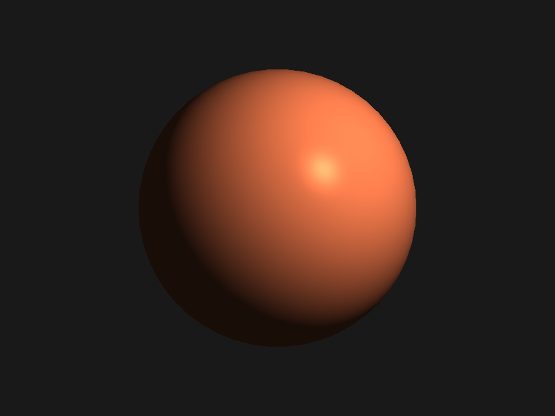

# Code for Visualization Course

Based on Visual Studio 2019, GLFW and GLAD.

GLFW: https://www.glfw.org/download.html, compile the source code by CMake to generate the code.

GLAD: https://glad.dav1d.de/

## Some Rendering Results

### Demo

### Experiment-1

本实验视见变换与光照模型




### Experiment-2

体绘制


#### ball


从左往右：500*500 vertices，500*500 vertices，50*50 vertices。
#### Cylinder

```c
const float CYLINDER_RADIUS = 0.5;
const float CYLINDER_HEIGHT = 1.0;
const int CIRCLE_FACE_ANGLE_INTERVALS = 100;
const int CIRCLE_FACE_RADIUS_INTERVALS = 100;
    
const float CIRCLE_FACE_ANGLE_DELTA = 2.0 * PI / CIRCLE_FACE_ANGLE_INTERVALS;
const float CIRCLE_FACE_RADIUS_DELTA = CYLINDER_RADIUS / CIRCLE_FACE_RADIUS_INTERVALS;

const int SIDE_FACE_INTERVALS_X = 100;
const int SIDE_FACE_INTERVALS_Y = 100;
const float SIDE_FACE_ANGLE_DELTA = 2.0 * PI / SIDE_FACE_INTERVALS_X;
const float SIDE_FACE_HEIGHT_DELTA = CYLINDER_HEIGHT / SIDE_FACE_INTERVALS_Y;
    
vector<float> NORMAL = { 0.0, 1.0, 0.0 };
float ROTATE_ANGLE = 60.0 * PI / 180.0;
vector<float> OFFSET = { 0.0, 0.0, 0.0 };
```


```c
const float CYLINDER_RADIUS = 0.5;
const float CYLINDER_HEIGHT = 1.0;
const int CIRCLE_FACE_ANGLE_INTERVALS = 100;
const int CIRCLE_FACE_RADIUS_INTERVALS = 100;
    
const float CIRCLE_FACE_ANGLE_DELTA = 2.0 * PI / CIRCLE_FACE_ANGLE_INTERVALS;
const float CIRCLE_FACE_RADIUS_DELTA = CYLINDER_RADIUS / CIRCLE_FACE_RADIUS_INTERVALS;

const int SIDE_FACE_INTERVALS_X = 100;
const int SIDE_FACE_INTERVALS_Y = 100;
const float SIDE_FACE_ANGLE_DELTA = 2.0 * PI / SIDE_FACE_INTERVALS_X;
const float SIDE_FACE_HEIGHT_DELTA = CYLINDER_HEIGHT / SIDE_FACE_INTERVALS_Y;
    
vector<float> NORMAL = { 1.0, 1.0, 1.0 };
float ROTATE_ANGLE = 60.0 * PI / 180.0;
vector<float> OFFSET = { 0.0, 0.0, 0.0 };
```


## 代码说明

本次实验部分代码参考自：https://github.com/toolchainX/Volume_Rendering_Using_GLSL.git

主要绘制函数如下所示

```c
int draw_shape(int shape_flag);
int VolumeRendering(int volume_choice);
```

在main函数中调用
```c
#include "volumerendering_utils.h"

int main()
{
    // int flag = draw_shape(DRAW_SPHERE);
    // int flag = draw_shape(DRAW_CUBIC);
    // int flag = VolumeRendering(HEAD_RENDERING);
    int flag = VolumeRendering(GEN_RENDERING);
    return flag;
}
```

主要使用的几个类包括
```
shader: 用于加载GLSL着色语言段
camera: 用于通过鼠标键盘得到相应的视见变换，进行显示
volume: 产生体素数据（球、圆柱构成的体素数据）
```

## 具体实验内容

### 实验1

- 熟悉OpenGL使用
- 显示一个球面和正方形表面
  - 数据结构、颜色（RGBA）、视见变换（改变观察点观察正方形显示）
  - 光照模型（改变镜面反射参数观察球面显示效果）
- 实验报告

### 实验2

- 实现体绘制的光线跟踪算法
- 实验与综述报告（不需要单独实验报告）

### 综述报告

- 体积绘制方法综述报告
- 研究背景、方法原理、算法、实验讨论、结论、参考文献

### 时间安排

- 学期结束前提交：source code、实验报告、综述报告
- 研究生网站下载评语页注明、填写相应内容
- 文件打包，“学号姓名”命名，发送到 luo.list@seu.edu.cn


